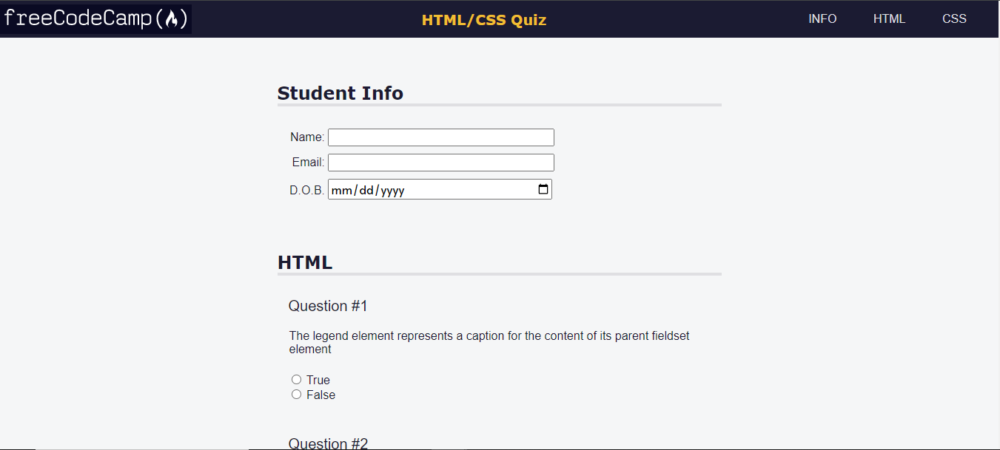
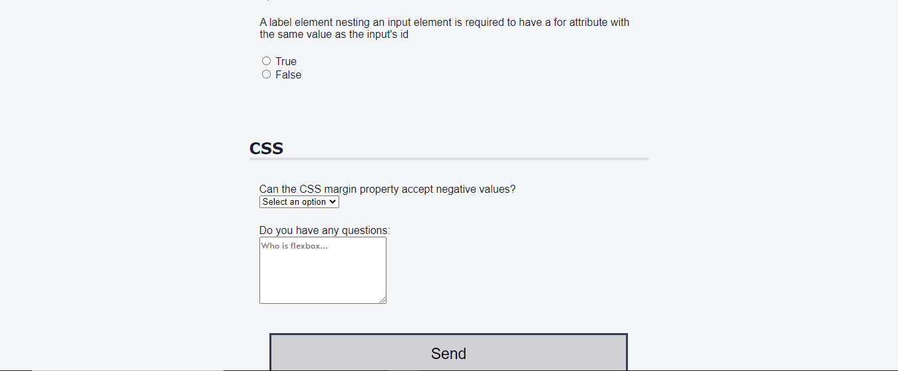

# Accessibility by building a Quiz

In this project, you will be able to access the navbar links by keys (shortcut keys). This project will be different from others. However, It is simple but some accesskeys that will be more efficient for user experience.

- Key for **INFO** is: `alt`+`i`
- Key for **HTML** is: `alt`+`h`
- Key for **CSS** is: `alt`+`c`

<h2>How to Access these Keys?</h2>
 
- **For Windows:** Typically, the shortcut is activated using **`Alt`** + **`accesskey`**. In some browsers, you might need to use **`Alt`** + **`Shift`** + **`accesskey`**.

- **For Mac:** Usually, the shortcut is activated using **`Control`** + **`Option`** + **`accesskey`**.

# Result

